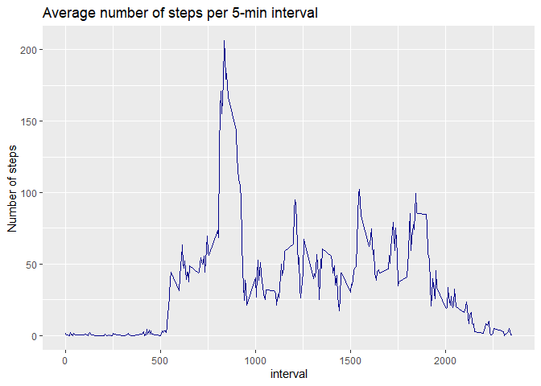

## Loading necessary packages
Two packages are needed - **tidyverse** to work with data and **lubridate** to work with dates. As the operating system is working in a local language, the R studio session needs to be set to English, in order to properly work with the names of the week.  

```r
library(tidyverse)
library(lubridate)
Sys.setlocale("LC_TIME", "C")
```

## Loading and preprocessing the data
Reading the data from .csv file and transforming to a tibble:

```r
activity_data <- read.csv("activity.csv")
activity <- as_tibble(activity_data)
```
Changing the format of the date from character to the date format:

```r
activity %>% mutate(date = ymd(date))
```

```
## # A tibble: 17,568 × 3
##    steps date       interval
##    <int> <date>        <int>
##  1    NA 2012-10-01        0
##  2    NA 2012-10-01        5
##  3    NA 2012-10-01       10
##  4    NA 2012-10-01       15
##  5    NA 2012-10-01       20
##  6    NA 2012-10-01       25
##  7    NA 2012-10-01       30
##  8    NA 2012-10-01       35
##  9    NA 2012-10-01       40
## 10    NA 2012-10-01       45
## # ℹ 17,558 more rows
```


## What is mean total number of steps taken per day?

Calculating the total number of steps for each day:

```r
activity_sum <- activity %>% group_by(date) %>% 
        filter(!is.na(steps))%>%
        summarise(sum_step = sum(steps))
```

### Plotting the the number of steps per day
Histogram of the total number of steps taken each day - based on the previously calculated sum of the steps per day:

```r
plot1 <- ggplot(activity_sum, aes(x = sum_step)) + 
        geom_histogram(color="darkblue", fill="lightblue") +
        xlab("Steps per day") +
        scale_y_continuous(breaks = seq(0, 8, by = 2)) +
        ggtitle("Number of steps per day")
plot1
```

<!-- -->


### Calculation of the mean and median of the total number of steps taken per day:

```r
activity_summary <- activity_sum %>%
        summarise(mean=mean(sum_step), median = median(sum_step))
print(activity_summary)
```

```
## # A tibble: 1 × 2
##     mean median
##    <dbl>  <int>
## 1 10766.  10765
```
The mean and median are 10766 and 10765, respectively, so they are quite similar. This means that the data are evenly distributed. 

## What is the average daily activity pattern?
Calculation and plotting the mean number of steps per interval across all dates:

```r
activity_int <- activity %>% group_by(interval) %>% 
        filter(!is.na(steps))%>%
        summarise(avg = mean(steps))
plot2 <- ggplot(activity_int, aes(x = interval, y = avg)) +
        geom_line(color="darkblue") +
        ylab("Average number of steps") +
        ggtitle("Average number of steps per 5-min interval")
plot2
```

<!-- -->

Finding the interval with the maximal number of steps:

```r
activity_max <- activity_int %>%
        filter(avg == max(avg))
activity_max
```

```
## # A tibble: 1 × 2
##   interval   avg
##      <int> <dbl>
## 1      835  206.
```
The interval with the maximal mean number of steps accross all days is the interval 835 (with the mean of 206 steps). 

## Imputing missing values
Finding the number of missing values in the original dataset:

```r
sum(is.na(activity))
```

```
## [1] 2304
```
There are 2304 missing values in the original dataset.
To fill the missing values the mean number of steps for the same interval calculated from the available data from other days was used. This method allows to get the missing values from the same time of the day so it should give the most reliable results.  

```r
activity_noNA <- activity %>% 
        group_by(interval) %>% 
        mutate(steps = ifelse(is.na(steps), mean(steps, na.rm = T), steps))
activity_noNA <- activity_noNA %>% mutate(date = ymd(date))
activity_sum_noNA <- activity_noNA %>% group_by(date) %>% 
        summarise(sum_step = sum(steps))
activity_summary_noNA <- activity_sum_noNA %>%
        summarise(mean=mean(sum_step), median = median(sum_step))
print(activity_summary_noNA)
```

```
## # A tibble: 1 × 2
##     mean median
##    <dbl>  <dbl>
## 1 10766. 10766.
```


The mean and median after filling in the missing values are  10766 and 10766, respectively, so they are almost identical to the values previously calculated, when the NAs were ignored. This is the results of the chosen method of missing values calculation, based on the data from the same intervals from the days for which the data was available.  

### Plotting the the number of steps per day (after filling the missing data)

```r
plot3 <- ggplot(activity_sum_noNA, aes(x = sum_step)) + 
        geom_histogram(color="darkblue", fill="lightblue") +
        xlab("Steps per day") +
        scale_y_continuous(breaks = seq(0, 8, by = 2)) +
        ggtitle("Number of steps per day")
plot3
```

<!-- -->

## Are there differences in activity patterns between weekdays and weekends?

Defining the weekdays:

```r
weekdays <- c('Monday', 'Tuesday', 'Wednesday', 'Thursday', 'Friday')
```

Classification of days into previously defined weekdays and the other (non-defined) days into weekends: 

```r
activity_wk <- activity_noNA %>% 
        mutate(weekday = weekdays(date)) %>%
        mutate(type = if_else(weekday == "Saturday" | 
        weekday == "Sunday", "weekend", "weekday"))
```

### Calculating and plotting the mean number of steps per interval across all dates

```r
activity_int_wk <- activity_wk %>% group_by(type, interval) %>% 
        summarise(avg = mean(steps))
```


```r
plot4 <- ggplot(activity_int_wk, aes(x = interval, y = avg)) +
        geom_line(color="darkblue") +
        ylab("Average number of steps") +
        ggtitle("Average number of steps per 5-min intervals") +
        facet_grid(rows = vars(type))
plot4
```

<!-- -->
  
The daily activity patterns between weekdays and weekends are somehow similar, but there are also several differences visible. Activity starts earlier during weekdays than on the weekends and during the weekdays there is a high peak of activity early in the day, which is not visible during the weekends. 
